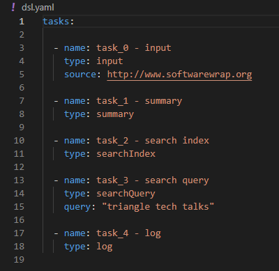

# DSL
Demo specific to yaml/json based DSLs. 

* https://www.softwarewrap.org/

## Problem

DSLs based on yaml/json are essentially a contract. Avoid leaking underlying technology details in your DSLs to avoid problem issues.

## Solution

Execute custom DSLs driving abstracted third-party tools. Touching on the dynamic DSL driver, schemas, templates, serialization, and some use cases including rapid prototyping of yaml/json based DSLs. Describe some performance considerations as well.

## Demo 

### Goal

### Yaml

### Jsonschema

* [schema.json](./schema.json)
* https://json-schema.org/

### DSL engine

* [main.go](./main.go)
* zero structs

* yaml is a superset of json

* steps

* execution

### UI awesomeness

* Generate objects and forms from jsonschema
* Validate without having to hit a server
* IDE support
* Decouple frontend and backend
* Performance gains 
 
### Issues addressed with proper abstracted implementations over leaky implementations

* learning curve
* hooks
* does too much
* does too little
* performance issues
* deprecation
* complexity
* topology or process overheads
* scaling properties

## Links

* https://www.softwarewrap.org/
* https://github.com/softwarewrap/dsl
* https://json-schema.org/
* https://github.com/Jeffail/gabs
* https://rjsf-team.github.io/react-jsonschema-form/

## Contact

* https://www.linkedin.com/in/terry-herron-00649b82/
